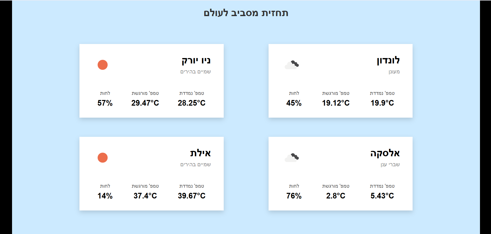

# Weather App

אפליקציית React המציגה תחזית מזג אוויר עולמית עבור מספר ערים.  
הנתונים מתקבלים מ-API של OpenWeatherMap ומוצגים בעברית.

## איך מריצים?

1. מתקינים את התלויות: npm install

2. מריצים את הפרויקט: npm run dev

## קבצים עיקריים

- `src/App.jsx` - רכיב ראשי שמנהל את הנתונים ומציג את הכרטיסים.
- `src/components/WeatherCard.jsx` - כרטיס תצוגה לכל עיר.
- `src/components/weatherApi.js` - פונקציה לקבלת נתוני מזג אוויר מה-API.
